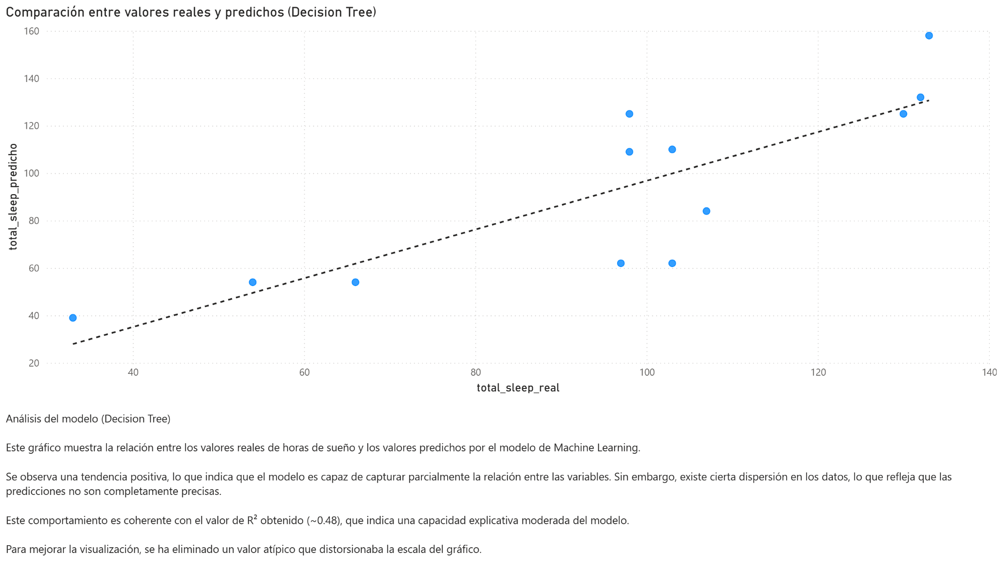
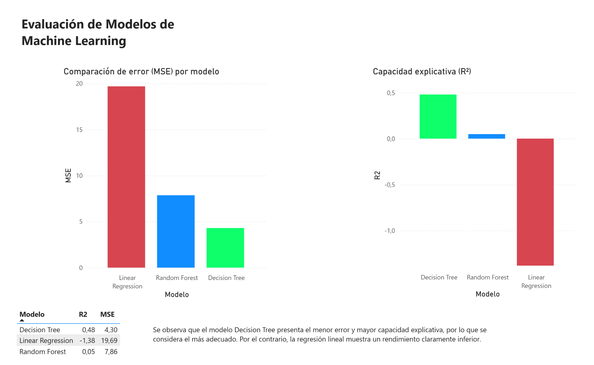

# End-to-End Machine Learning Pipeline with SQL and Power BI

## Project Overview

This project demonstrates a complete Machine Learning workflow, from data ingestion and storage to model training, evaluation and visualization.

The objective is to predict the total sleep time of different mammal species using biological characteristics stored in a SQL database.

## Technologies Used

* Python
* Pandas
* NumPy
* SQLite
* Scikit-Learn
* Power BI
* Azure Machine Learning (learning environment)

## Dataset

The dataset contains information about 62 mammal species and includes variables such as:

* Body weight
* Brain weight
* Maximum life span
* Gestation time
* Predation index
* Sleep exposure index
* Danger index
* Total sleep (target variable)

## Workflow

1. Data loading from CSV
2. Data cleaning and preprocessing
3. Storage in SQLite database
4. SQL data extraction
5. Machine Learning model training
6. Model evaluation
7. Export of predictions
8. Visualization in Power BI

## Machine Learning Models

The following regression models were evaluated:

* Linear Regression
* Decision Tree Regressor
* Random Forest Regressor

## Results

The Decision Tree model achieved the best performance:

* MSE ≈ 4.29
* R² ≈ 0.48

These results indicate that the relationship between the variables is not purely linear and that tree-based models are better suited for this dataset.

## Dashboard Preview

### Real vs Predicted Values



This visualization compares the real sleep values with the predictions generated by the Decision Tree model.

---

### Model Performance Comparison



Comparison of the evaluated Machine Learning models using MSE and R² metrics.

The Decision Tree model achieved the best overall performance.

## Repository Structure

```text
data/
database/
reports/
src/
README.md
```

## Author

Sebastià Porta Bentzen

Junior Data Scientist | AI Engineer Junior
